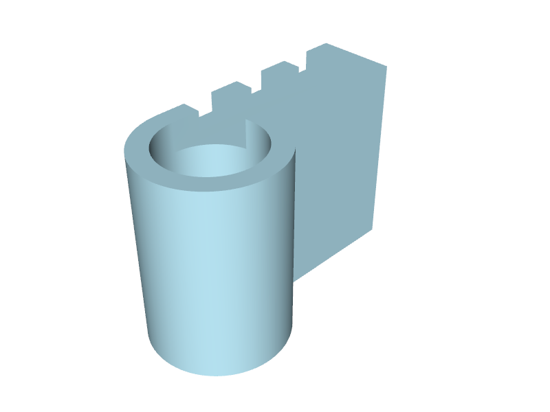
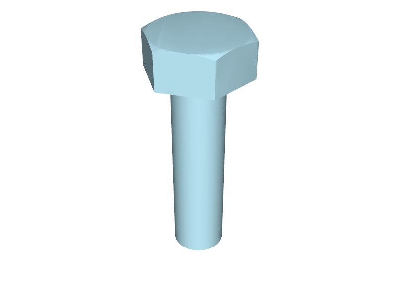
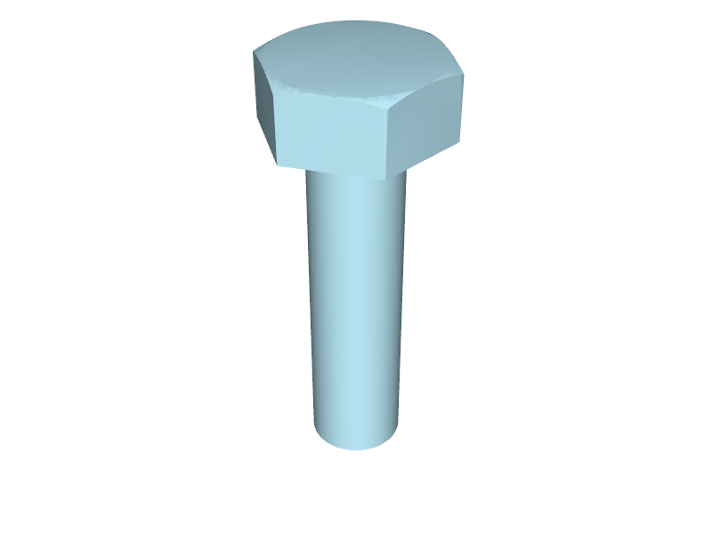

# fcstd2b123d

Translate FreeCAD `.FCStd` files into [build123d](https://github.com/gumyr/build123d) Python.

The goal is to bridge two CAD modes that LLMs handle very differently:
**FreeCAD's GUI** is great for sketching out a 3D shape interactively, but the
resulting `.FCStd` (XML + binary BRep blobs) is opaque to a model. **build123d
Python** is the inverse — it's terrible to start from a blank prompt ("design
me a bracket") but trivial to iterate on once the geometry is in code.

This translator goes one direction: FreeCAD → build123d. Rough something out
in FreeCAD, translate, then ask an LLM to vary it.

For parametric source files (those with a FreeCAD Spreadsheet), the output is
a Python *function* whose signature mirrors the spreadsheet's named
parameters — so a downstream consumer can call `make_part(width=50)` rather
than search-and-replace module-level constants.

## Status

**Alpha — single-author research project.** Working end-to-end against a real
corpus of FreeCAD files, with documented gaps. The architecture, tier plan,
test methodology, and ADRs are all in `SPEC.md` and `docs/adr/`.

| Tier | What it handles | Status |
|------|-----------------|--------|
| 1 | Part-workbench primitives: Box, Cylinder, Sphere, Cone, Torus | ✅ |
| 2 | PartDesign Body + Sketcher + Pad / Pocket / Revolution; Part::Extrusion; multi-feature chaining | ✅ |
| 3 | Fillet / Chamfer (with `Face<N>` references) | ✅ |
| 4 | Patterns (LinearPattern / PolarPattern / Mirrored) | ✅ |
| 5 | Boolean ops between bodies (Part::Cut / Fuse / Common) | partial — `Part::Cut` and `Fuse` work via Part-workbench paths; `Common` not yet |
| 6 | Spreadsheet preservation → function-wrapped emit | ✅ |
| 7 | `PartDesign::Hole`, Sweep, Loft, Helix, App::VarSet | not yet |

**Test status:** 148 tests pass across two CI lanes (a fast lane for the
schema and comparison utility; a slower lane that runs the translator end-to-end
against fixture files via a FreeCAD subprocess). Across 148 random Parts
Library files sampled in five batches, **109 pass (~74%)** end-to-end with
geometric properties matching FreeCAD's to OCCT round-off precision. The
failures are documented per-batch in `tests/fixtures/*/KNOWN_ISSUES.md`.

## Example: FreeCAD's PartDesign tutorial

The file you get when you walk through [FreeCAD's PartDesign Bearingblock tutorial](https://wiki.freecad.org/Basic_Part_Design_Tutorial) — a D-block with a rounded hub, a rectangular trough on top, a 50 mm circular pocket through the hub, and a 12-segment stepped slot cut all the way through. Four features, 145 × 70 × 100 mm overall.

| FreeCAD source | build123d translation |
|:---:|:---:|
|  |  |
| `partdesign_example.FCStd` | `partdesign_example.py` (55 lines) |

`fcstd2b123d` translates it to **55 lines of build123d Python**. The four feature operations read straight off the FreeCAD feature tree:

```python
# PartDesign::Pad 'Pad': length=100.0 (reversed)
pad = extrude(sketch, amount=-100)

# PartDesign::Pocket 'Pocket': length=15.0
pocket = pad - extrude(sketch_001, amount=-15)

# PartDesign::Pocket 'Pocket001': length=50.0
pocket_001 = pocket - extrude(sketch_003, amount=-50)

# PartDesign::Pocket 'Pocket002': ThroughAll (reversed)
pocket_002 = pocket_001 - extrude(sketch_002, amount=1000000)

result = pocket_002
```

Sketches feed each Pad/Pocket via a hoisted 1D curve and an explicit `make_face` — runs of consecutive line segments collapse into a single `Polyline`:

```python
sketch_profile = Polyline(
    (20.358962517357057, 20), (-55, 20), (-55, -20), (55, -20)
) + CenterArc(center=(54.999978668734606, 15), radius=35, start_angle=270.00003491975656,
              arc_size=261.7867543785052)
sketch = make_face(sketch_profile)
```

See the [full output](docs/examples/partdesign_example.py).

STL exports of both shapes (drop into any STL viewer to confirm by eye): [FreeCAD source](docs/examples/partdesign_example.freecad.stl) · [build123d translation](docs/examples/partdesign_example.build123d.stl).

## Example: ANSI hex cap screw (topological-naming on a real fastener)

A real Parts Library fastener — `ANSI-ASME-B18_2_1_Hex_Head_Cap_Screw_1_4-20x1.FCStd` — built from a revolved cross-section, a hex-socket Pocket, and a tip Chamfer. The Chamfer is the interesting bit: FreeCAD records its target as `Edge<N>` against the evaluated BRep, which only makes sense inside FreeCAD. The translator captures that edge's geometric midpoint at translation time and emits a build123d filter that picks the same edge in build123d's BRep (see [ADR-0001](docs/adr/0001-freecad-runtime-vs-standalone-parser.md)).

| FreeCAD source | build123d translation |
|:---:|:---:|
|  |  |
| `hex_cap_screw.FCStd` | `hex_cap_screw.py` (73 lines) |

The Chamfer emit, end-to-end:

```python
# PartDesign::Revolution 'Revolution': angle=360.0
revolution = revolve(sketch, axis=Axis.Z, revolution_arc=360)

# PartDesign::Pocket 'Pocket' (body-less, ThroughAll)  -- the hex socket
pocket = revolution - extrude(sketch_001, amount=-1000000.0)

# PartDesign::Chamfer 'Chamfer': size=1.0 on 1 edges of Pocket
chamfer_0 = chamfer(
    _edges_at(pocket, [(-3.1750000000000007, 0, -25.400000000000006)]), length=1
)
```

(The trailing `_0` on `chamfer_0` avoids shadowing the build123d `chamfer` function — when a FreeCAD feature would lowercase to an imported function name, the translator appends a numeric suffix.)

`_edges_at` is a one-line helper emitted at module top — it iterates build123d's edges and keeps the one whose midpoint matches the FreeCAD-captured target. That single mechanic is what makes the FreeCAD-runtime translator worth the two-environment setup: a pure-text `.FCStd` parser can't resolve `Edge<N>` because FreeCAD doesn't store edge geometry in the XML — it lives in the BRep blob that only the FreeCAD evaluator understands.

Full output: [`hex_cap_screw.py`](docs/examples/hex_cap_screw.py). STL exports: [FreeCAD source](docs/examples/hex_cap_screw.freecad.stl) · [build123d translation](docs/examples/hex_cap_screw.build123d.stl).

## What the output looks like

A non-parametric file (a single `Part::Box`):

```python
"""Auto-generated by fcstd2b123d from box_10x20x30.FCStd."""
from build123d import Box, Pos

# Part::Box 'TestBox': Length=10.0, Width=20.0, Height=30.0
test_box = Pos(5, 10, 15) * Box(10, 20, 30)

result = test_box
```

A parametric file (a Spreadsheet driving the Box dimensions):

```python
"""Auto-generated by fcstd2b123d from spreadsheet_box.FCStd."""
from build123d import Box, Pos


def make_part(depth=15, height=10, width=25):
    """Translated parametric design. Defaults match the source values."""
    # Part::Box 'Box': Length=width, Width=depth, Height=height
    box = Pos(width / 2, depth / 2, height / 2) * Box(width, depth, height)
    return box


result = make_part()
```

A tier-3 file with a fillet (showing the topological-naming resolution):

```python
# PartDesign::Fillet 'Fillet': radius=3.0 on 4 edges of Pad
fillet_0 = fillet(
    _edges_at(pad, [(0, 0, 7.5), (30, 0, 7.5), (30, 20, 7.5), (0, 20, 7.5)]),
    radius=3,
)
```

The `_edges_at` helper (emitted once at module top) selects build123d edges
by geometric midpoint — captured from FreeCAD's evaluated BRep at translation
time. This is the central mechanic that makes the FreeCAD-runtime
architecture worthwhile (see [ADR-0001](docs/adr/0001-freecad-runtime-vs-standalone-parser.md)):
a pure-text FCStd parser can't resolve `Edge8` to a physical edge.

## Installation

This project uses [`uv`](https://docs.astral.sh/uv/). FreeCAD is not on PyPI;
the translator runs inside a FreeCAD-enabled Python environment (typically
from conda-forge).

```bash
# Project deps (test/build/CI side):
uv sync --extra dev

# FreeCAD env (translator side) — example via micromamba:
mkdir -p .conda/bin
curl -L https://github.com/mamba-org/micromamba-releases/releases/latest/download/micromamba-linux-64 \
  -o .conda/bin/micromamba
chmod +x .conda/bin/micromamba
MAMBA_ROOT_PREFIX="$PWD/.conda" .conda/bin/micromamba \
  create -y -n freecad -c conda-forge freecad=1.0 numpy black python=3.12
```

Why two environments? See [ADR-0001](docs/adr/0001-freecad-runtime-vs-standalone-parser.md):
the translator uses FreeCAD's own Python API to read the file (it's the only
way to resolve topological-naming references like `Edge8`), while the tests
and emitted code live in a separate build123d environment.

## Usage

```bash
PYTHONPATH=.conda/envs/freecad/lib \
  .conda/bin/micromamba run -n freecad \
  python -m fcstd2b123d path/to/file.FCStd -o output.py
```

Add `--json-out output.features.json` to also emit a structured feature
record per [SPEC §14](SPEC.md) — useful for downstream tooling.

### Verifying the translation

Translation is best-effort: edge cases in the source's tier coverage can
slip through and produce a `.py` that runs cleanly but builds the wrong
shape. Pass `--verify` to also emit a FreeCAD-side snapshot of the source's
geometric properties:

```bash
# Translate AND emit verification sidecars (.expected.json + .pointcloud.json):
PYTHONPATH=.conda/envs/freecad/lib \
  .conda/bin/micromamba run -n freecad \
  python -m fcstd2b123d path/to/file.FCStd -o output.py --verify
```

Then in the build123d env, confirm the emitted Python reproduces the FreeCAD
geometry:

```bash
uv run fcstd2b123d-verify output.py path/to/file.expected.json
```

`fcstd2b123d-verify` exec's the translated Python, extracts the same
geometric properties, and compares (with the Hausdorff backstop active
whenever the matching `.pointcloud.json` is present). Exits 0 on PASS, 1 on
FAIL. The two-step shape mirrors the
[two-environment architecture](docs/adr/0001-freecad-runtime-vs-standalone-parser.md):
each step runs in the env where its imports actually work.

## Running the tests

```bash
# Fast lane (no FreeCAD needed):
uv run pytest tests/test_properties.py tests/test_compare.py

# Full suite (needs FREECAD env vars; will run the translator end-to-end):
FCSTD2B123D_FREECAD_PYTHON=.conda/envs/freecad/bin/python \
FCSTD2B123D_FREECAD_PYTHONPATH=.conda/envs/freecad/lib \
  uv run pytest
```

## How it's tested

Property-based regression against FreeCAD itself: every fixture has a JSON
snapshot of its geometric properties (volume, surface area, centre of mass,
sorted principal moments of inertia) captured by running FreeCAD on the
file. The translator's output is then `exec()`'d in the build123d
environment, properties of the resulting `Part` are extracted via the same
math, and compared with magnitude-aware tolerances.

This means tests are stable under emitter refactors — the test cares about
the *geometry*, not the source string. Topologically-different but
geometrically-equivalent results pass; subtle precision drift fails (which
is what you want). See [ADR-0002](docs/adr/0002-property-based-regression-tests.md) for the reasoning.

## Project layout

```
src/fcstd2b123d/
  cli.py              — `fcstd2b123d` (translator, FreeCAD env)
  verify_cli.py       — `fcstd2b123d-verify` (compare emitted .py to snapshot, build123d env)
  translator.py       — top-level translate()
  loader.py           — FreeCAD document opening
  primitives.py       — tier-1 Part-workbench primitives
  sketch.py           — Sketcher (line / arc / circle, multi-loop)
  partdesign.py       — Body / Pad / Pocket / Revolution / Fillet / Chamfer / patterns
  parametric.py       — Spreadsheet extraction + ExpressionEngine rewriting
  emitter.py          — code emission + black formatting
  context.py          — TranslationContext (accumulates per-step structured data)
  freecad_properties.py — geometric property extraction (translator-side, lightweight)
  snapshot.py         — FreeCAD-side property + point-cloud capture (--verify uses this)
  verify.py           — build123d-side extraction + property comparison + Hausdorff
  hausdorff.py        — pure-math Hausdorff distance
  properties.py       — Properties dataclass (shared schema)

docs/adr/             — architecture decision records (0001..0004)
SPEC.md               — the project spec, including the tier plan and §13 coverage analysis

tests/
  fixtures/           — .FCStd inputs + .expected.json + .pointcloud.json snapshots
  snapshot.py         — thin shim around fcstd2b123d.snapshot (manual re-snapshot tool)
  test_*.py           — schema, comparison, tier 1/2/3/4/6 translator tests, corpus tests

data/parts-library/   — coverage database of the FreeCAD Parts Library

tools/                — analyzer + corpus management scripts
```

## Documentation

- [`SPEC.md`](SPEC.md) — purpose, goals, non-goals, tier plan, test
  methodology, structured-output schema, deferred dataset vision.
- [`docs/adr/`](docs/adr/) — the four foundational ADRs (FreeCAD runtime vs
  standalone parser; property-based testing; no-pip-path; excluded geometric
  properties).

## License and attribution

The translator source code is MIT licensed (see [LICENSE](LICENSE)).

This repository also includes:
- Two FreeCAD bundled example files (LGPL-2.0-or-later)
- Many test fixtures from the FreeCAD-library (CC-BY-3.0)
- A coverage-metadata derivative of the FreeCAD-library (CC-BY-3.0)

Full attribution and per-category obligations are in [NOTICE](NOTICE). The
FreeCAD project is at https://www.freecad.org/.

## Status of contributions

Currently a single-author research project. Issues and PRs welcome but the
direction will continue to be driven by the SPEC's tier plan and the
empirical coverage data in `data/parts-library/coverage.json`.
